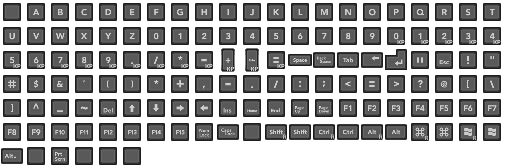

# How to Create a Glyph Collection

This article will cover how to create a [GlyphCollection](xref:LMirman.RewiredGlyphs.GlyphCollection) from start to finish. By the end of this article you will have created glyphs to represent the most common device types: `Keyboard`, `Mouse`, `Xbox`, `Playstation`, and `Nintendo` controllers.

## Prerequisites

- Basic understanding of the Unity interface and concepts
- A unity project with Rewired and Rewired Glyph Manager prepared
- A collection of sprites to represent the controller actions.
	- If you don't have any there are many CC0/Public Domain offerings available such as [Xelu](https://thoseawesomeguys.com/prompts/), [Mr. Breakfast](https://mrbreakfastsdelight.itch.io/mr-breakfasts-free-prompts), and [Kenney](https://kenney.nl/assets/input-prompts)
	- If you utilize any of the assets above, while not required by their license, you are highly encouraged to donate to the creator of the asset for their time.
	- For this article we will be creating glyphs from the `Xelu` set
- Aseprite or an alternative program to create sprite sheets 

## Part 1 Assemble Sprites into a Sprite Sheet

If the sprites you acquired for your glyph are all separate (such that each icon is its own file) it is a good idea to assemble them into a sprite sheet. This reduces the number of files you have to track in your project, can improve texture optimization, and is generally a best practice for storing related sprites.

We will be using [Aseprite](https://www.aseprite.org/download) but there are likely other applications available that will offer similar function.

### 1.1 Import Sprites into Animation Track

Drag all of the sprites representing the controller type into a single Aseprite project animation track.

> 
> 
> Example of an Aseprite project with glyph sprites import

Sort the frames into an order that groups related symbols together.

> [!TIP]
>
> Aseprite can import all files at once into a single project if they are named in a numerical sequence.
>
> Below is a primitive Python script that renames all items in a specified directory in a numerical order.
> 
> <details>
> <summary>Basic Python Renaming Script</summary>
> 
> ```python
> import os
> 
> def rename_files_in_directory(directory):
> 	# Get a list of all files in the directory
> 	files = [f for f in os.listdir(directory) if os.path.isfile(os.path.join(directory, f))]
> 	files.sort()
> 
> 	# Rename each file
> 	for index, filename in enumerate(files):
> 		# Get the file extension
> 		file_extension = os.path.splitext(filename)[1]
> 		
> 		# Create the full path for the original and new file names
> 		new_name = f"{index + 1}{file_extension}"
> 		old_path = os.path.join(directory, filename)
> 		new_path = os.path.join(directory, new_name)
> 		
> 		# Rename the file
> 		os.rename(old_path, new_path)
> 			
> 		print(f"Renamed '{old_path}' to '{new_path}'")
> 
> # Usage
> directory_path = "B:\Downloads\Xelu\Keyboard & Mouse\Dark"
> rename_files_in_directory(directory_path)
> ```
> 
> </details>

### 1.2 Export Sprite Sheet

Once you have finished importing all sprites needed into the Aseprite project you can now export them all into a single sprite sheet.

Press `Ctrl+E` to bring up the export window or from `File -> Export -> Export Sprite Sheet`.

> 
>
> Example export settings window configuration

> 
>
> Example sprite sheet for Keyboard glyphs using a slightly modified Xelu set and the above export settings 

### 1.3 Repeat Process for All Controllers

Repeat step 1.1 and 1.2 for each device you have glyphs for.

> [!WARNING]
> 
> Before continuing to the next part you should have sprite assets ready for:
> 
> - Keyboard
> - Mouse
> - Xbox Gamepad
> - Playstation Gamepad
> - Switch Gamepad

## Part 2 Prepare Sprites in Unity

Now that we have our sprite sheets ready it is time to bring them into our Unity project.

> [!CAUTION]
>
> Ensure every Glyph sprite asset has a unique name, otherwise there will be a conflict when using them in TextMeshPro.

### 2.1 Import Sprite Assets to Project

Create a new folder in your Unity project for housing our sprite assets and our future Glyph Collection and Glyph Maps. Drag the sprite assets into your new created Unity project folder.

### 2.2 Configure Sprite Import Settings

Select all of your sprite assets and set their `Sprite Mode` to `Multiple` so we can divide it into many sprite from the sheet layout.

> [!TIP]
>
> If your sprites utilize pixel art consider changing `Filter Mode` to `Point (no filter)` and setting `Compression` to `None`.

### 2.3 Use Sprite Editor to Divide Sprite Sheet

For each sprite you imported use the [Sprite Editor](https://docs.unity3d.com/Manual/SpriteEditor.html) tool to slice the sprite sheet into its separate elements.

Refer to [the Official Unity Documentation](https://docs.unity3d.com/2021.3/Documentation/Manual/sprite-editor-use.html) for more information on using the Sprite Editor tool

> 
>
> Example of sliced sprite sheet using Sprite Editor window

> [!WARNING]
>
> Before continuing to the next part you should now have:
> - All sprites used for glyphs are imported into the project
> - Sprite sheets have been sliced into its elements

## Part 3 Create and Assign Glyph Maps

Now that we have our sprites ready in Unity we can now create a [GlyphMap](xref:LMirman.RewiredGlyphs.GlyphMap) for each device so we can tell the program what sprite is associated with what input.

### 3.1 Create a Glyph Map

Let's begin by creating our first Glyph Map by right clicking in the Project window of Unity and navigating to `Create/Rewired Glyphs/Glyph Map`. 
This will create an empty Glyph Map at this location.

#### The Glyph Map Inspector

> 

With our glyph map selected lets take a look at the Inspector window.
Here we will find various fields such as:
- `Generate Keyboard`: If used while ReInput is ready, generates a list of *all* keyboard actions, including descriptions.
- `Generate Mouse`: If used while ReInput is ready, generates a list of *all* mouse actions, including descriptions.
- `Controller Data Files`: Used for generating and validating `Joystick` actions for a particular device.
- `Validate Map`: When true shows warnings and errors for this device if it is based on a `Joystick` device.
- `Based on`: Indicates what controller this map is intended to represent for validation and action generation purposes. Can only be a Joystick device and can **not** be a `Mouse` or `Keyboard`.
	- `Set by Controller`: Validate this map based on a specific controller device
	- `Set by Template`: Validate this map based on a controller template
	- `X` clear target if it isn't meant to represent a controller
- `Page`: Editor only shows 10 glyphs at a time, scroll to view more

**Glyph Editor**

- `Full Description`: The standard name of this input action such as `Left Stick Horizontal`, `A`, `Left Trigger`
- `Positive Description`: The name of the positive direction for Axis inputs such as `Left Stick Right`.
	- Leave empty if this is not an Axis input, will default to `Full Description`.
- `Negative Description`: The name of the negative direction for Axis inputs such as `Left Stick Left`.
	- Leave empty if this is not an Axis input, will default to `Full Description`.
- `Full Sprite`: The standard sprite for this input action.
- `Positive Sprite`: The sprite for positive direction of Axis inputs
	- Leave empty if this is not an Axis input.
- `Negative Sprite`: The sprite for the negative direction of Axis inputs
	- Leave empty if this is not an Axis input.

> 

### 3.2 Generate Keyboard and Mouse Map

> [!NOTE]
>
> As of `v2.0.0`, due to technical limitations, the application will need to be running to generate `Mouse` and `Keyboard` glyph maps.

With your newly created glyph map selected from 3.1, enter playmode and click the `Generate Keyboard` button in the inspector. After confirming the dialogue that appears your glyph map will be populated with all the actions found on your keyboard device. If it generated as expected should see `132` actions total, each with a `Full Description` associated with it.

For now, with the application still running, lets continue by creating a new `Glyph Map` and using `Generate Mouse` populate it with the actions found on the mouse device. 

We should now have two glyph maps with descriptions for the mouse and keyboard. Exit playmode and use `Ctrl+S` to save the changes to the assets. We'll return to our keyboard and mouse glyph maps later to populate it with sprites but let's first create the other glyph maps we need first.

### 3.3 Generate Joystick Template Maps

> Unlike 3.2 you do not need to be in playmode to generate Joystick glyph maps

1. Create 3 new glyph maps in our project: `Xelu Template Xbox`, `Xelu Template Playstation`, and `Xelu Template Switch`.
	1. Each will be associated with one of the three types of symbols to show glyphs for controllers that implement the `Gamepad` template. 
2. For each created glyph map:
	1. Set the `Controller Data Files` to your Rewired's controller data files
	2. Ensure `Validate Map` is true
	3. Click `Set by Template` and pick `Gamepad` from the dropdown
		1. You will see many errors appear! This is expected and normal since our glyph map is empty and therefore doesn't have the actions for the Gamepad template.
	4. Resolve the validation errors by generating actions based on the `Gamepad` template.
	5. Repeat this process for the other template glyph maps created
3. We now have template glyph maps with descriptions for the template actions. Much like 3.2 we will return to these maps later to associate sprites with the actions.

### 3.4 Generate Joystick Device Maps

> In this step we will be generating for the `Pro Controller`, `Sony Dualsense`, and `Xbox One Controller` devices. You may choose to generate for additional devices if you have glyphs for those devices.

1. Create another 3 glyph maps: `Xelu Pro Controller`, `Xelu Dualsense`, `Xelu Xbox One`
2. For each created glyph map:
	1. Set the `Controller Data Files` to your Rewired's controller data files
	2. Ensure `Validate Map` is true
	3. Click `Set by Controller` and pick either `Pro Controller`, `Sony Dualsense`, and `Xbox One Controller` from the dropdown depending on the map
		1. As with 3.3 You will see errors since we don't have the actions for the device we set.
	4. Resolve the validation errors by generating actions based for the device.
	5. Repeat this process for the other controller glyph maps created
3. We now have *all* the glyph maps we need! Now let's populate them with the sprites we created so we can show them to the user!

> [!NOTE]
>
> **What's the difference between a controller map and a template map?**
>
> A controller map represents a map whose elements are *directly* associated with a particular device. These maps are uniquely created for each device.
> 
> On the other hand, a `Template` map represents a map whose elements are *translated* onto a controller template which is able to be used by many devices.
>
> Controller maps are great for showing sprites and descriptions that are tailored for that device, especially if it has inputs that are not found on the template. Template maps however have compatibility with almost any controller of that type saving you time from making a map for *every* controller possible.

### 3.5 Populate Maps with Sprites

Now for the fun part! For each glyph map created in 3.2 - 3.4 go through the actions generated and place the sprites imported during part 2 into the associated action.

> [!TIP]
>
> Generally speaking you should only associate a positive and negative sprite with an action if it has a positive and negative description. 

> [!NOTE]
>
> Don't have a sprite for some actions? That can be okay! Most glyph displays are able to display the description for the action instead of using its sprite.

> 
>
> Example of sprites added to a `Pro Controller` glyph map

> [!WARNING]
>
> Before continuing to the next part you should now have:
> - Maps created for `Mouse`, `Keyboard`
> - Template maps for `Xbox`, `Playstation`, and `Switch` styled glyphs
> - Controller maps for `Xbox One`, `Dualsense`, and `Pro Controller` devices
> - Sprites associated with every actions generated for the maps (where applicable)

## Part 4 Assemble Glyph Collection

Now that we are able to associate elements with a sprite and description with the maps created in part 3 we can put it all together within a [GlyphCollection](xref:LMirman.RewiredGlyphs.GlyphCollection) on the [RewiredGlyphManager](xref:LMirman.RewiredGlyphs.RewiredGlyphManager) so it can be loaded and referenced by the [InputGlyphs](xref:LMirman.RewiredGlyphs.InputGlyphs) system at runtime.

### 4.1 Create Glyph Collection Asset

Right click in the Project view of unity and create a new empty `GlyphCollection` by going to `Create -> Rewired Glyphs -> Glyph Collection`. We'll name ours `Xelu Dark`. With your Glyph Collection selected let's begin by giving it a unique identifier key, for this example we'll give it the key `xelu_dark`.

> The key is used for referencing this collection at runtime if we have multiple collections loaded.

Let's also assign our Rewired's `Controller Data Files` so we can assign controllers in the next step.

### 4.2 Assign Controller Maps

> 

Our collection should now look something like the above image. As you can see we have some errors saying we don't have maps assigned for certain devices! Let's resolve that by editing the controller maps and defining some glyph maps there.

Let's add 5 entries to the list of controller maps on the GlyphCollection, one for each of the controller maps created in step `3.2` and `3.4`. Then populate the entires with the following values:

- `Keyboard Glyph Map`, `Keyboard`
- `Mouse Glyph Map`, `Mouse`
- `Dualsense Glyph Map`, `Joystick`, `Sony DualSense`
- `Switch Glyph Map`, `Joystick`, `Pro Controller`
- `Xbox One Glyph Map`, `Joystick`, `Xbox One Controller`

> 
>
> Example of a populated GlyphCollection Controller Maps 

### 4.3 Assign Template Maps

Returning to the main screen you'll see we still have an unresolved `No template maps!`. Let's enter the `Edit Template Maps` screen and add some now.

Let's create 4 template maps, one for each of the symbol preferences available, and populate them with their respective glyph map we created in `3.3`.

> [!NOTE]
>
> The `Auto` symbol preference entry is used as a default in cases where there is no entry for the other symbol preferences. If you don't define an `Auto` entry, the first item in the list is used as the fallback instead.

>  
>
> Example of a populated GlyphCollection Template Maps  

### 4.4 Assign Non-Input Glyph Values

If you have a sprite in your project that you'd like to show when a glyph can't be found you can assign them to the `Unbound`, `Null`, and `Uninitialized` glyphs within the `GlyphCollection`'s `Non-Input Glyphs` section.

- `Unbound`: Shown when the action queried is valid but the player doesn't have any input for that action
- `Null`: Shown when the developer queried an action that doesn't exist on the Input Manager
- `Uninitialized`: Show when Rewired or InputGlyphs are not initialized

> 
>
> Example Non-Input Glyph configuration

### 4.5 Set Collection on RewiredInputManager

We have finally finished creating our `GlyphCollection`! Now for our final step, loading it into the `InputGlyphs` system. On your Rewired Input Manager find your `RewiredGlyphManager` component or add one if there is not one already. On your `RewiredGlyphManager` set the `Glyph Collection` value to our newly created glyph collection. This will load it and set it as the default on initialization.

> 

## Summary

Congratulations! We have completed our creation of a `GlyphCollection`! If all is configured well you should now see your glyphs being output in your application.

Some additional things consider that we did not do in this article:

- Consider making additional controller maps for any additional controllers you want to support that we did not create here
- Consider making additional collections that incorporate different visual styles for the glyphs such as a dark mode and light mode